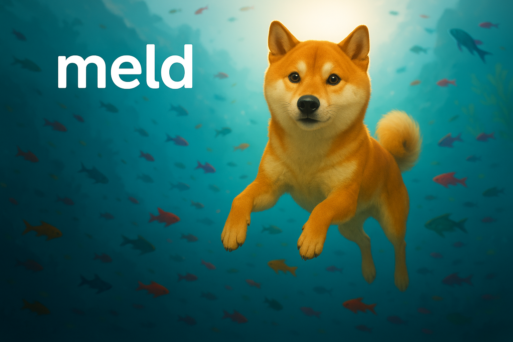

<!--
Keep this document short & concise,
linking to external resources instead of including content in-line.
See 'release/text/readme.html' for the end user read-me.
-->

Meld
====

Meld is your AI-powered assistant designed specifically for Blender. Enhance your workflow by solving complex Blender issues instantly, generating Python scripts effortlessly, and automating intricate animations.

Keep in mind that we are in Alpha. We're very keen on iterating quickly to make sure we can supercharge everyone's blender workflow!

### Key Features
- **Problem Solving**: Instant solutions to complex Blender issues.
- **Script Generation**: Generate Python scripts directly from natural language.
- **Animation Automation**: Simplify complex animation processes dramatically.
- **Concept to Creation**: Transform ideas into animations in minutes, not hours.

### Downloads for macOS and Windows 

[Download links](https://www.meldai.dev/)

### Resources
- [Website](https://www.meldai.dev/)
- [Discord](https://discord.gg/4ysj3ZQM)

### Community Support
- [Discord Community](https://discord.gg/4ysj3ZQM) — Join the discussion and get help from fellow users and developers.
- [X (formerly Twitter)](https://x.com/choi_sungeun) — Reach out personally at [@choi_sungeun](https://x.com/choi_sungeun).

Development
-----------

- [Build Instructions](https://developer.blender.org/docs/handbook/building_blender/)

License
-------

Meld integrates closely with Blender, which is licensed under the GNU General Public License, Version 3.

See [blender.org/about/license](https://www.blender.org/about/license) for details.

## License
This software is licensed under the Creative Commons Attribution-NonCommercial 4.0 International License (CC BY-NC 4.0).

You are free to use, modify, and distribute this software for personal, non-commercial use, provided you attribute the original creator.

See the full license here: [CC BY-NC 4.0](https://creativecommons.org/licenses/by-nc/4.0/)

---

MELD © 2025
